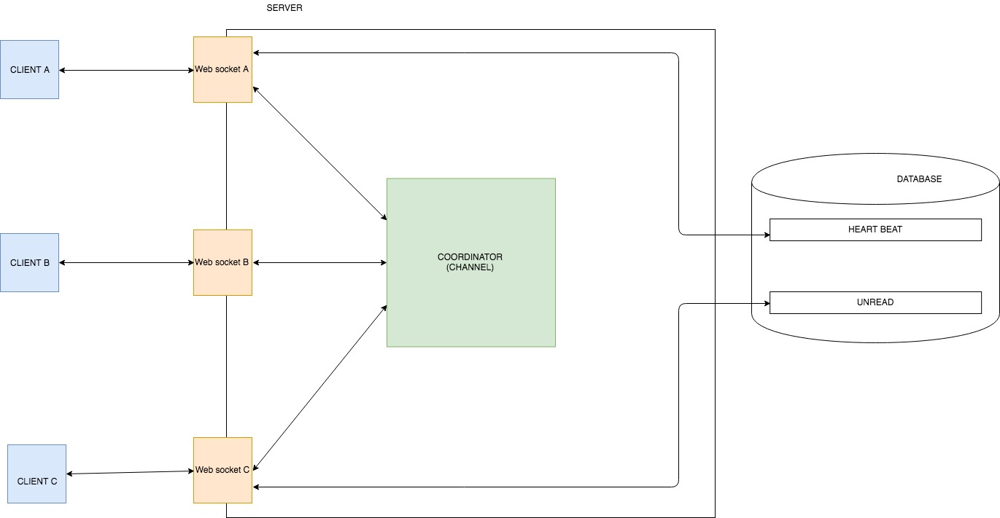

# Chat System Project

### Install

How to instance and Debug

Check GOPATH

```
env | grep GOPATH
GOPATH=/Users/dongvt/Data/ybstudio/hope_pet/hope-pet-alice:/Users/dongvt/go

cd /Users/dongvt/go/src/
git clone https://github.com/eightybstudio/hope-pet-chat-backend.git
```
```
sudo go get -u github.com/kardianos/govendor
```
packge managerment for golang

```
govendor sync
```

# DOCUMENT 

The reason will be describe how this system works, all basic features of this chat system.

* Login with internal user
* Check user online/offline
* send message online
* Send message offline and get old 

*System diagram*



## Introduce about flow of system
After connecting into system, it will create a specific session.
When ClientA send a msg to ClientB, msg will go to websocket, websocket will be not only `Publisher` but also `Subcriber`. 
Upon `COORDINATOR` it will broadcast msg to all current connections which are connecting to Server. After that, msgs are filtered and routed to correct ClientB based on  `ReceiveUserId`. At the same time Server will store msg into table  `UNREAD` in database.
If ClientB recived msg , it will send a msg `CONFIRM` to confirm that already got msg. Server will remove msg in `UNREAD`.
If user already in state offline, so when they online will send a command  `FETCH` to fect all msgs which have not read yet. After that send command `CONFIRM` to remove on Server.

## AUTHEN

NOTIC: URL call websocket always has  2 param to validate

```
ws://localhost:2345/chat/private?userId=1&session=688b23a0ffa044ad001417b52401e738
```
```
userId:  user identification
session: Chat sesion was generated by this way : md5sum(secretkey + userId + yymmddhhmm)
```
Purpose of `session` to make sure user can not be `session hijack`, `fake user` .. Make sure system is secure


## Check user online/ offline

System provides a connect method `websocket`, client sends a heartbeat mgs every 5s to server

FLOW:
```
1/CLIENTA  ---------[heartbeat 5s/1] -->    SERVER
2/SERVER  --------------[ADD]------>        DATABASE
3/CLIENTB -----[check status CLIENTA] --->  SERVER
4/SERVER  -----[query DB]------------>      DATABASE
5/SERVER   ---------[STATUS]----------->    CLIENTB
```

## Send message online

FLOW: `CLIENTA` send 1 `msg` `cho CLIENTB`

```
CLIENTA -------msg-------> SERVER
SERVER  --------msg------> DATABASE (UNREAD)
SERVER  --------msg------> CLIENTB
CLIENTB ------confirm----> SERVER
SERVER  ------remove msg--> DATABASE (UNREAD)
```

## Send message offline.

FLOW: `CLIENTA` send 1 `msg` to `CLIENTB` but `CLIENTB` is already offline

```
CLIENTA -------msg-------> SERVER
SERVER  --------msg------> DATABASE (UNREAD)
CLIENTB  -------fetch------> SERVER
SERVER  --------msg[]------> CLIENTB
CLIENTB ------confirm----> SERVER
SERVER  ------remove msg--> DATABASE (UNREAD)
```
